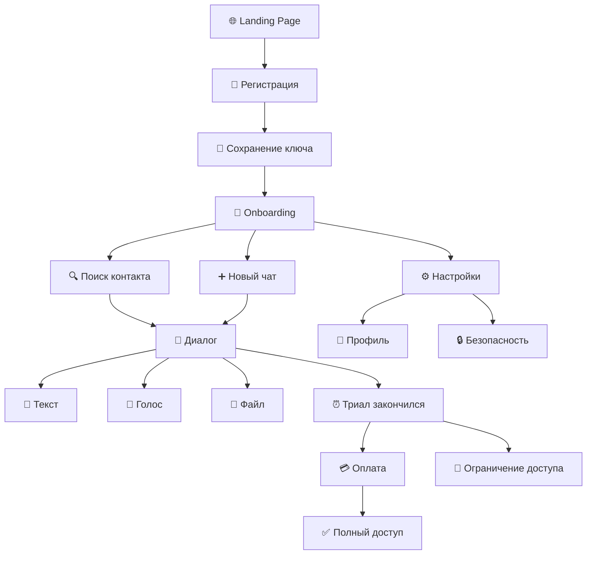

---
cssclasses:
  - university-dashboard
  - document-note
---

# 🎨 Miro Board: SmurfGram User Experience Map

> [!doc-card] Документ проекта
> **Раздел:** ПИД / аналитические материалы
> **Файл:** 05_miro_board_layout.md
> **Назначение:** Схема размещения UX-артефактов на общей доске.

> **Инструкция:** Рекомендуемый размер фрейма: 4000 x 3000 px

---

## 🎯 Блок 1: User Persona

**Расположение:** Верхний левый угол, 800x600px

---

### Карточка пользователя

| | |
|---|---|
| **Фото** | 👤 |
| **Имя** | Александр "Alex" Петров |
| **Возраст** | 28 лет |
| **Город** | Москва |
| **Профессия** | 💻 IT-специалист |
| **Доход** | 💰 80-150к ₽ |

**🎯 Цели:**
- Защитить деловую переписку
- Избежать блокировок РКН
- Контролировать свои данные

**😤 Боли:**
- Telegram требует VPN
- WhatsApp — привязка к телефону
- Не доверяет бесплатным сервисам

**💬 Цитата:**
> "Готов платить 500₽/мес, чтобы не думать о VPN"

**🛠️ Инструменты:**
iPhone 14 Pro, Firefox, Bitwarden, WireGuard

---

## 🗺️ Блок 2: User Journey Map

**Расположение:** Центр, 3000x800px

### Этапы

| Этап | Действия | Точки контакта | Эмоции | Барьеры | Возможности |
|------|----------|----------------|--------|---------|-------------|
| **Awareness** | Увидел рекламу на Habr | Баннер | 😐 Интерес | Недоверие к новому | Видео-обзор с демо |
| **Consideration** | Сравнивает с конкурентами | Landing page | 😊 Анализ | Неясные преимущества | Таблица сравнения |
| **Registration** | Регистрируется с ключом | Форма регистрации | 😰 Волнение | Страх потерять ключ | Подсказки по сохранению |
| **Onboarding** | Пустой чат, туториал | Приветствие | 😌 Пустота | Нет контактов | Тестовый бот |
| **Activation** | Первый диалог с контактом | Поиск по нику | 😃 Успех! | Собеседник не тут | QR-код для обмена |
| **Retention** | Ежедневное общение | Чаты | 😊 Комфорт | Нет звонков | Добавить звонки |
| **Conversion** | Оплачивает подписку | Экран оплаты | 😰 Сомнение | Цена высокая | Скидка 20% |
| **Advocacy** | Приглашает друзей | Реферальная ссылка | 😄 Уверенность | Нет программы | Запустить рефералку |

---

## 📋 Блок 3: User Stories Board

**Расположение:** Под Journey Map, 3000x1000px

### 🎯 Epic: Регистрация и безопасность

| US-001 Регистрация с ключом | US-002 Никнейм | US-003 2FA |
|-----------------------------|----------------|------------|
| ✅ **Готово** | ✅ **Готово** | 📋 **В планах** |
| Как новый пользователь | Как новый пользователь | Как пользователь |
| Я хочу зарегистрироваться с ключом | Я хочу выбрать никнейм | Я хочу включить 2FA |

### 💰 Epic: Подписка и оплата

| US-006 Триал 7 дней | US-007 Покупка подписки | US-008 Автоплатеж |
|---------------------|------------------------|-------------------|
| ✅ **Готово** | ✅ **Готово** | 📋 **В планах** |
| Как новый пользователь | Как пользователь | Как подписчик |
| Я хочу протестировать 7 дней | Я хочу купить подписку | Я хочу авто-продление |

### 💬 Epic: Коммуникации

| US-010 Поиск по нику | US-011 Текстовые сообщения | US-012 Голосовые |
|----------------------|---------------------------|------------------|
| ✅ **Готово** | ✅ **Готово** | ✅ **Готово** |
| Как пользователь | Как пользователь | Как пользователь |
| Я хочу найти собеседника | Я хочу отправлять текст | Я хочу записывать голосовые |

| US-013 Файлы до 50МБ | US-014 Групповые чаты | US-016 Звонки |
|----------------------|------------------------|---------------|
| ✅ **Готово** | ✅ **Готово** | 📋 **В планах** |
| Как пользователь | Как пользователь | Как пользователь |
| Я хочу отправлять файлы | Я хочу создавать группы | Я хочу звонить голосом |

### ⚙️ Epic: Управление аккаунтом

| US-018 Смена аватара | US-019 Смена пароля | US-020 Удаление аккаунта |
|----------------------|---------------------|--------------------------|
| ✅ **Готово** | ✅ **Готово** | 📋 **В планах** |
| Как пользователь | Как пользователь | Как пользователь |
| Я хочу менять аватар | Я хочу менять пароль | Я хочу удалить все данные |

---

## 🔄 Блок 4: User Flow Diagram

**Расположение:** Правый столбец, 800x2000px

---

## 📊 Блок 5: Feature Matrix

**Расположение:** Низ, 3000x400px

| Функция | Регистрация | Коммуникации | Подписка | Безопасность | Управление |
|---------|:-----------:|:------------:|:--------:|:------------:|:----------:|
| Ключ + пароль | ✅ | | | | |
| Никнейм | ✅ | | | | |
| Поиск по нику | | ✅ | | | |
| Текстовые | | ✅ | | | |
| Голосовые | | ✅ | | | |
| Файлы 50МБ | | ✅ | | | |
| Группы | | ✅ | | | |
| Триал 7 дней | | | ✅ | | |
| Оплата | | | ✅ | | |
| 2FA | | | | 📋 | |
| Смена пароля | | | | ✅ | ✅ |
| Смена аватара | | | | | ✅ |

**Легенда:** ✅ Реализовано | 📋 В планах | ⬜ Не запланировано

---

## 🎨 Цветовая схема для Miro

| Назначение | HEX | RGB |
|------------|-----|-----|
| ✅ Готово | #4CAF50 | 76, 175, 80 |
| 📋 В планах | #FF9800 | 255, 152, 0 |
| ⬜ Не начато | #9E9E9E | 158, 158, 158 |
| 🔴 Высокий приоритет | #F44336 | 244, 67, 54 |
| 🟡 Средний приоритет | #FFC107 | 255, 193, 7 |
| 🔵 Информация | #2196F3 | 33, 150, 243 |
| Фон карточки | #FFFFFF | — |
| Фон эпика | #E3F2FD | — |
| Граница | #E0E0E0 | — |

---

## 📐 Размеры и расположение элементов

### Карточка User Persona
- Размер: 400 x 500 px
- Позиция: x=50, y=50
- Стикеры: Фото (круг 80px), Текст (14pt), Заголовки (18pt bold)

### User Journey Map
- Размер: 2800 x 600 px
- Позиция: x=500, y=50
- 8 колонок по 350px каждая

### User Stories (Kanban)
- Размер каждой карточки: 280 x 150 px
- Позиция: x=50, y=700
- 3 колонки в ряд, отступ 20px

### User Flow
- Размер: 600 x 1400 px
- Позиция: x=3000, y=50
- Блоки: 150 x 80 px, стрелки между ними

### Feature Matrix
- Размер: 2800 x 400 px
- Позиция: x=50, y=1800
